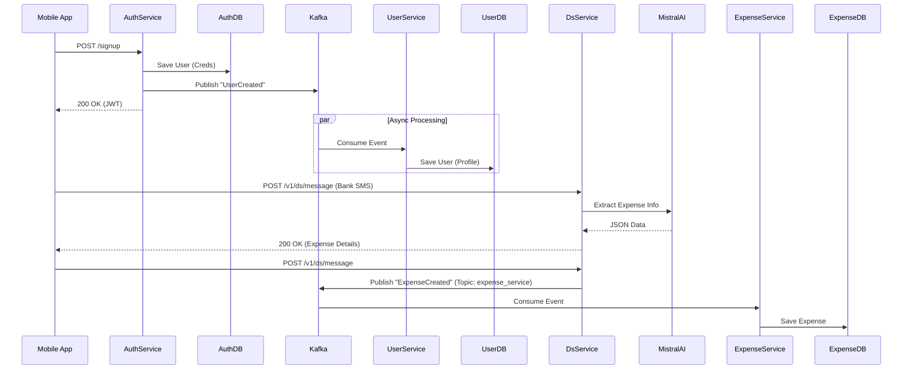

# Expense Tracker - Microservices System

Welcome to the **Expense Tracker** project. This repository houses a robust, event-driven microservices architecture designed for high scalability and modularity. It handles secure user authentication and rich profile management using modern Java Spring Boot practices.

## 🚀 System Architecture

The system is split into two primary microservices: `authService` and `userService`, decoupled asynchronously via **Kafka**.



## 🌟 Key Features

### 1. High Scalability

I designed this system to handle high traffic loads efficiently:

- **Stateless Authentication**: Uses **JWT (JSON Web Tokens)** for session management, allowing the `authService` to scale horizontally without sticky sessions.
- **Asynchronous Processing**: **Kafka** queues user creation events, ensuring that the critical "Onboarding" flow never blocks even if the `userService` is under heavy load.
- **Independent Scaling**: The `userService`, `authService`, and `expenseService` can be scaled independently based on their specific resource demands.

### 2. Reusability & Modularity

The codebase is structured for easy reuse in future projects:

- **Decoupled Logic**: The `authService` focuses solely on credentials and tokens, while `userService` manages profile data. This separation of concerns allows either service to be plugged into other architectures.
- **Configuration Driven**: All key settings (Database URLs, Kafka Topics) are externalized in `application.properties`, making environment switching seamless.

### 3. Cross-Platform Mobile Experience

- **Unified Codebase**: Built with **React Native** and **Expo**, providing a native experience on both iOS and Android from a single codebase.
- **Modern UI**: Utilizes **Gluestack UI** and **NativeWind** for a beautiful, accessible, and responsive interface.
- **SMS Integration**: Features an intelligent SMS parser that extracts expense details from bank messages using AI.

## 🛠️ Microservices & Frontend Overview

### A. Auth Service (`org.example`)

**Responsibility**: Authentication, Token Generation, Credential Storage.

- **Controller**: Handles `/signup` and `/login` endpoints.
- **Producer**: Publishes `UserInfoDto` events to the `userEvents` Kafka topic upon successful signup.
- **Security**: Implements Spring Security with a custom `JwtAuthFilter`.

### B. User Service (`com.arnav.userService`)

**Responsibility**: Managing User Profiles (Address, Phone, Email).

- **Consumer**: Listens to the `userEvents` topic. When a user signs up, it automatically creates a corresponding profile in the User DB.
- **Service Layer**: Handles business logic for creating and retrieving detailed user information.
- **Profile API**: Exposes `GET /user/{userId}` for profile retrieval.

### C. Data Science Service (`dsService`)

**Responsibility**: Intelligent processing of data, specifically extracting expense information from Bank SMS messages using LLMs.

- **Stack**: Python, Flask, Langchain.
- **LLM Integration**: Uses **Mistral AI** (via Langchain) to parse unstructured SMS text into structured JSON data.
- **API**: Exposes `/v1/ds/message` to accept SMS text and return structured expense objects.
- **Producer**: Publishes extracted expense data (including `user_id`) to the `expense_service` Kafka topic.
- **Port**: Runs on port `8002` (Local) / `5000` (Docker) to avoid conflicts with Kong.

### D. Expense Service (`org.example`)

**Responsibility**: Core banking and transaction management.

- **Consumer**: Listens to the `expense_service` topic to receive extracted expenses and persist them.
- **Database**: Stores expense records with support for multi-currency transactions.
- **Currency**: Default currency is set to **INR (₹)**.

### E. Frontend (`frontend`)

**Responsibility**: The user interface for the Expense Tracker.

- **Stack**: React Native, Expo, TypeScript.
- **Routing**: Expo Router for file-based routing.
- **UI Architecture**: Component-based design components for reusability.
- **Reusable Auth Module**: The `Login.tsx` and `SignUp.tsx` screens are designed to be plug-and-play.
- **Dynamic Configuration**: Includes `Config.ts` to automatically switch API URLs.
- **Enhanced UI/UX**:
  - **Landing Page**: A dedicated entry point (`index.tsx`) with social links and clear navigation.
  - **Global Navigation Bar**: Persistent, themed header across all screens for consistent branding.
  - **Session Persistence**: Intelligent "Auto-Login" logic that remembers users, handles redirects, and manages logout states gracefully.
  - **SMS Scanning**:
    - **Manual**: A modal interface to paste and extract expenses from SMS texts.
    - **Automatic**: A native **Background Service** (Headless JS) that listens for incoming bank SMS messages, extracts the data, and syncs it with the backend even when the app is closed.

## 🔧 Technical Stack

- **Frontend**: React Native, Expo, TypeScript, Gluestack UI, NativeWind
- **Backend Language**: Java, Python
- **Framework**: Spring Boot, Flask
- **Messaging**: Apache Kafka
- **Database**: MySQL
- **Security**: Spring Security & JWT
- **Data Science**: Langchain, Mistral AI
- **Infrastructure**: Docker, Kong Gateway

## 🏃‍♂️ Local Development Setup

### Ports

| Service             | Port   | Description                      |
| :------------------ | :----- | :------------------------------- |
| **Kong Proxy**      | `8000` | Entry point for API requests     |
| **Auth Service**    | `9820` | Authentication & Identity        |
| **User Service**    | `9810` | User Profiles                    |
| **Expense Service** | `9830` | Expense Management               |
| **DS Service**      | `8002` | Python/AI Service (Local)        |
| **Kafka (Local)**   | `9093` | Kafka Bootstrap for Host Machine |
| **Frontend**        | `8081` | Metro Bundler (Default)          |

### Running Locally

1.  **Start Backend Services**:

    **IMPORTANT**: You must use the `--build` flag to ensure the services are built from the source code, as they now include local Dockerfiles.

    ```bash
    docker-compose up -d --build
    ```

    This command starts the entire microservices ecosystem:
    - **Infrastructure**: MySQL, Kafka, Kong Gateway
    - **Services**: Auth Service, User Service, Expense Service, DS Service

2.  **Start Frontend Application**:

    Navigate to the frontend directory and start the Expo server:

    ```bash
    cd frontend
    npm install
    npx expo start
    ```

    Scan the QR code with the Expo Go app (Android/iOS) or run on a simulator/emulator.

3.  **Access APIs**:
    - Access all services via the Kong Gateway at `http://localhost:8000`.
    - **Auth**: `/auth/v1/signup`, `/auth/v1/login`, `/auth/v1/logout`, `/ping`
    - **User**: `/user/...`
    - **Expense**: `/expense/v1/...`
    - **DS Service**: `/v1/ds/message`

### 4. Troubleshooting

**Common Issues:**

- **401 Unauthorized on Login/Home**:
  - Run `docker-compose down -v` to wipe the database volumes. This clears any "zombie" users or mismatched tokens.
  - Rebuild the services: `docker-compose up --build`.

- **Unique Constraint Error**:
  - Requires a service rebuild. The latest `auth-service` code automatically handles duplicate token cleanup.
