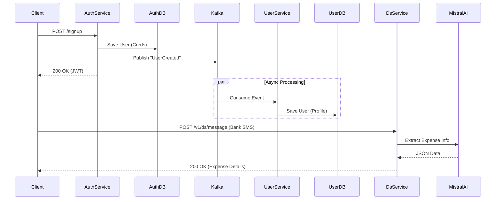

# Expense Tracker - Microservices System

Welcome to the **Expense Tracker** project. This repository houses a robust, event-driven microservices architecture designed for high scalability and modularity. It handles secure user authentication and rich profile management using modern Java Spring Boot practices.

## 🚀 System Architecture

The system is split into two primary microservices: `authService` and `userService`, decoupled asynchronously via **Kafka**.

## 🌟 Key Features

### 1. High Scalability

I designed this system to handle high traffic loads efficiently:

- **Stateless Authentication**: Uses **JWT (JSON Web Tokens)** for session management, allowing the `authService` to scale horizontally without sticky sessions.
- **Asynchronous Processing**: **Kafka** queues user creation events, ensuring that the critical "Onboarding" flow never blocks even if the `userService` is under heavy load.
- **Independent Scaling**: The `userService` and `authService` can be scaled independently based on their specific resource demands.

### 2. Reusability & Modularity

The codebase is structured for easy reuse in future projects:

- **Decoupled Logic**: The `authService` focuses solely on credentials and tokens, while `userService` manages profile data. This separation of concerns allows either service to be plugged into other architectures.
- **Configuration Driven**: All key settings (Database URLs, Kafka Topics) are externalized in `application.properties`, making environment switching seamless.

## 🛠️ Microservices Overview

### A. Auth Service (`org.example`)

**Responsibility**: Authentication, Token Generation, Credential Storage.

- **Controller**: Handles `/signup` and `/login` endpoints.
- **Producer**: Publishes `UserInfoDto` events to the `userEvents` Kafka topic upon successful signup.
- **Security**: Implements Spring Security with a custom `JwtAuthFilter`.

### B. User Service (`com.arnav.userService`)

**Responsibility**: Managing User Profiles (Address, Phone, Email).

- **Consumer**: Listens to the `userEvents` topic. When a user signs up, it automatically creates a corresponding profile in the User DB.
- **Service Layer**: Handles business logic for creating and retrieving detailed user information.

### C. Data Science Service (`dsService`)

**Responsibility**: Intelligent processing of data, specifically extracting expense information from Bank SMS messages using LLMs.

- **Stack**: Python, Flask, Langchain.
- **LLM Integration**: Uses **Mistral AI** (via Langchain) to parse unstructured SMS text into structured JSON data.
- **API**: Exposes `/v1/ds/message` to accept SMS text and return structured expense objects.

## 🔧 Technical Stack

- **Language**: Java
- **Framework**: Spring Boot
- **Messaging**: Apache Kafka
- **Database**: MySQL
- **Security**: Spring Security & JWT
- **Data Science**: Python, Flask, Langchain, Mistral AI
